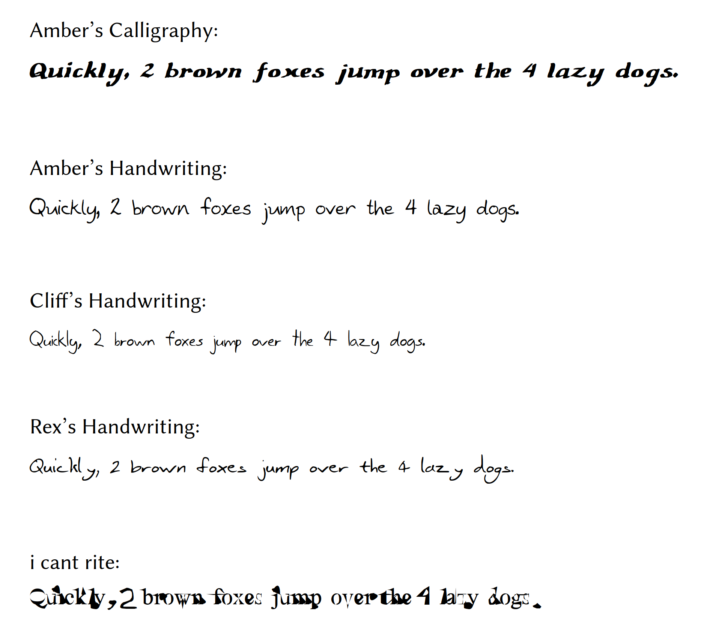

# The Kerr Family's Handwriting Fonts

TrueType fonts based from the Kerr siblings' handwriting ([Rex](https://www.focolab.org/team/rex-kerr%2C-phd), [Amber](https://erg.berkeley.edu/people/amber-kerr), [Cliff](https://cliffkerr.com/)):
- `amber_calligraphy.ttf`
- `amber_handwriting.ttf`
- `cliff_handwriting.ttf`
- `rex_handwriting.ttf`

Also included is `i_cant_rite.ttf`, which I created around the same time, if you really loathe your readers.

Examples:

Scanned and typefaceified c. 1995 using Font Forge (if I remember correctly). Note that only the basic ASCII character set is included.